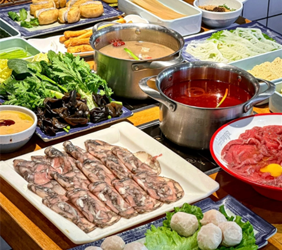
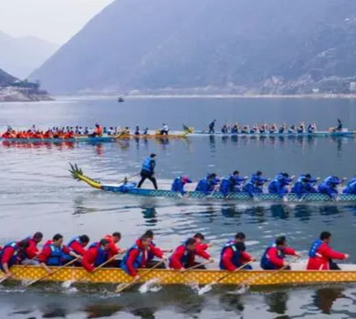
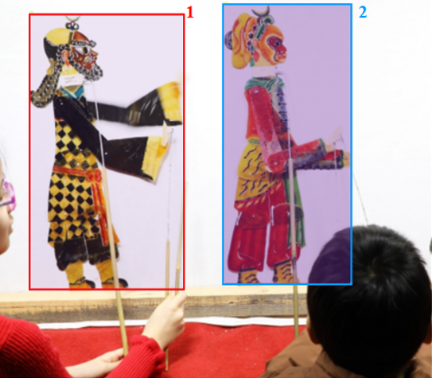
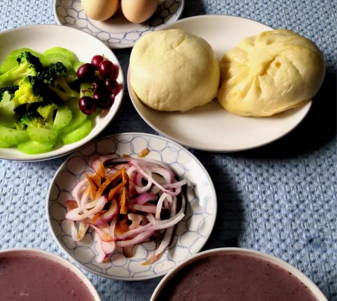
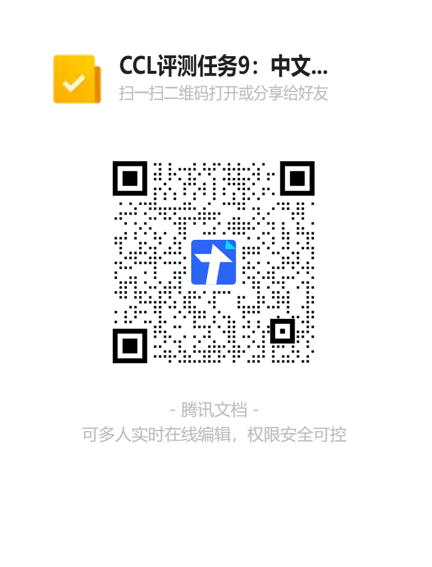

# 
<strong>CCL24-Eval 中文图文多模态理解评测任务</strong>

## 任务介绍

中文图文多模态理解评测（Chinese Vision-Language Understanding Evaluation，CVLUE）任务旨在从图文检索（Image-Text Retrieval）、视觉问答（Visual Question Answering）、视觉定位（Visual Grounding）和视觉对话（Visual Dialog）等四个任务多角度评价中文图文多模态预训练模型的图文多模态建模和理解能力。该任务包含以下5个子任务：

- 图片检索（Image Retrieval）：基于给定的文本描述从若干候选中检索出对应图片。
- 文本检索（Text Retrieval）：基于给定的图片从若干候选中检索出对应的文本描述。
- 视觉问答（Visual Question Answering）：基于给定的图片用短语回答问题。
- 视觉定位（Visual Grounding）：基于给定的图片和文本描述找出图片中对应的实体。
- 视觉对话（Visual Dialog）：基于给定的图片和对话历史从若干候选中选出最合适的回复文本。

## 评测数据

本任务包含以下15大类、92小类的图片，图片收集均由人工按照以下类别收集，且严格要求图片内容为中国文化环境中具有代表性或日常生活常见：

    <table>
        <tr >
        <td align="center"> <b>大类</b></td>
        <td align="center"> <b>小类</b></td>
        <td align="center"> <b>小类数量</b></td> 
        </tr>
        <tr>
        <td align="center">动物</td>
        <td align="center">大熊猫,牛,鱼,狗,马,鸡,鼠,鸟,人,猫</td>
        <td align="center">10</td>
        </tr>
        <tr>
        <td align="center">食物</td>
        <td align="center">火锅,米饭,饺子,面条,包子</td>
        <td align="center">5</td>
        </tr>
        <tr>
        <td align="center">饮品</td>
        <td align="center">奶茶,可乐,牛奶,茶,粥,酒</td>
        <td align="center">6</td>
        </tr>
        <tr>
        <td align="center">衣服</td>
        <td align="center">汉服,唐装,旗袍,西装,T恤</td>
        <td align="center">5</td>
        </tr>
        <tr>
        <td align="center">植物</td>
        <td align="center">柳树,银杏,梧桐,白桦,松树,菊花,牡丹,兰科,莲,百合</td>
        <td align="center">10</td>
        </tr>
        <tr>
        <td align="center">水果</td>
        <td align="center">荔枝,山楂,苹果,哈密瓜,龙眼</td>
        <td align="center">5</td>
        </tr>
        <tr>
        <td align="center">蔬菜</td>
        <td align="center">小白菜,马铃薯,大白菜,胡萝卜,花椰菜</td>
        <td align="center">5</td>
        </tr>
        <tr>
        <td align="center">农业</td>
        <td align="center">锄头,犁,耙,镰刀,担杖</td>
        <td align="center">5</td>
        </tr>
        <tr>
        <td align="center">工具</td>
        <td align="center">汤勺,碗,砧板,筷子,炒锅,扇子,菜刀,锅铲</td>
        <td align="center">8</td>
        </tr>
        <tr>
        <td align="center">家具</td>
        <td align="center">电视,桌子,椅子,冰箱,灶台</td>
        <td align="center">5</td>
        </tr>
        <tr>
        <td align="center">运动</td>
        <td align="center">乒乓球,篮球,游泳,足球,跑步</td>
        <td align="center">5</td>
        </tr>
        <tr>
        <td align="center">庆典</td>
        <td align="center">舞狮,龙舟,国旗,月饼,春联,花灯</td>
        <td align="center">6</td>
        </tr>
        <tr>
        <td align="center">教育用品</td>
        <td align="center">铅笔,黑板,毛笔,粉笔,原子笔,剪刀</td>
        <td align="center">6</td>
        </tr>
        <tr>
        <td align="center">乐器</td>
        <td align="center">古筝,二胡,唢呐,鼓,琵琶</td>
        <td align="center">5</td>
        </tr>
        <tr>
        <td align="center">艺术</td>
        <td align="center">书法,皮影,剪纸,秦始皇兵马俑,鼎,陶瓷</td>
        <td align="center">6</td>
        </tr>
    </table> 

### 数据样例

接下来，按任务类别给出各任务的数据样例

#### 图文检索

每张图片有 5 条各不相同的描述。

    
     
    
图文检索

对应的描述为：
1. 桌子中间摆放着火锅
2. 两种口味的火锅摆放在木质的桌子上
3. 一个辣的和一个菌汤锅底的火锅放在桌上
4. 火锅四周摆满了涮火锅用的蔬菜、肉、丸子等食材
5. 桌子中间摆放着两个口味的火锅，周围的陶瓷碗里盛放着涮火锅用的食材

#### 视觉问答

针对图片提问，并作出回答。

    
     
    
视觉问答

针对图片的问答为：
- Q: 龙舟划向什么方位? A: 右方
- Q: 有几支队伍在划龙舟? A: 5
- Q: 大多数人的姿势是站立还是坐着? A: 坐着

### 视觉定位

给出图片中，部分实体的描述，并给出其对应的 bounding box（在图中，用方框标出）。

    
     
    
视觉定位

实体的描述：
1. 戴眼镜女孩手里拿着的皮影
2. 短发男孩手里拿着的皮影

### 视觉对话

给出图片及其描述，针对图片进行问答对话。

    
     
    
视觉对话

- Caption: 蓝色桌垫上有许多食物 
- Q1: 桌上都有哪些食物? A1: 食物中有鸡蛋、包子、小菜、馒头和粥
- Q2: 桌上的粥是哪种粥? A2: 桌上的粥是黑米粥 
......
- Q10:桌面上的鸡蛋有几个? A10:桌面上有两个鸡蛋

## 评价指标

各子任务评测指标如下：

### 图文检索

针对图文检索任务，评测指标选用召回 $ R@k（k取1，5，10）$。

$$ R@k=\frac{正确结果在检索排名前 k 的样本个数}{全部样本个数} $$

### 视觉问答

针对视觉问答任务，评测指标比较简单，即回答问题的准确率 $ Accuracy $。

$$ Accuracy=\frac{正确回答个数}{全部问题个数} $$

### 视觉定位

针对视觉定位任务，评测指标基于重叠度 $ IoU $ ，选用图片对齐的准确率（框选范围的 $ IoU $ 值大于0.5视为正确）和 $ IoU $ 的均值。

$$ IoU=\frac{预测区域和真实区域的交集面积}{预测区域和真实区域的并集面积} $$
$$ IoU_{Accuracy}=\frac{预测结果 IoU 超过 0.5 的样本数量}{全部定位样本数量} $$
$$ \overline{IoU}=\frac{全部预测结果的 IoU 之和}{全部定位样本数量} $$

### 视觉对话

针对视觉对话任务，评测指标选用召回 $ R@k（k取1，5，10）$。

$$ R@k=\frac{正确结果在检索排名前 k 的样本个数}{全部样本个数} $$

__参赛模型的最终评测成绩取上述所有评价指标的宏平均值。__

## 评测赛程

具体赛程安排如下：

    <table>
        <tr >
        <td align="center"> <b>时间</b></td>
        <td align="center"> <b>事项</b></td>
        </tr>
        <tr>
        <td align="center">3月1日-4月9日</td>
        <td align="center">开放报名</td>
        </tr>
        <tr>
        <td align="center">4月10日</td>
        <td align="center">训练集、验证集发布</td>
        </tr>
        <tr>
        <td align="center">5月13日</td>
        <td align="center">盲测集发布</td>
        </tr>
        <tr>
        <td align="center">5月20日</td>
        <td align="center">测试集结果提交截止</td>
        </tr>
        <tr>
        <td align="center">5月31日</td>
        <td align="center">参赛队伍成绩及排名公布</td>
        </tr>
    </table> 

## 报名方式

选手可通过点击下方链接或扫描二维码进行报名

【腾讯文档】CCL评测任务9：中文图文多模态理解评测任务报名表 https://docs.qq.com/form/page/DTG9FdlFwT2h3ZHFJ

    
     
    

